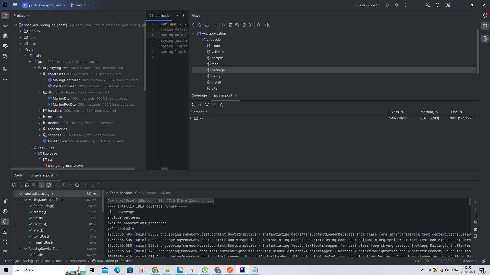

# test project for tracking mailing between posts

## stack:


## running:
1. pack jar file by command ```mvn clean package```
2. enter command ```java -Dspring.datasource.username=*** -Dspring.datasource.password=*** -jar post-0.0.1-SNAPSHOT.jar``` *** - password and username to db
3. to get interface enter in browser ```http://localhost:8080/swagger-ui/index.html```

### requierements for t3:
[X] 
[X] 
